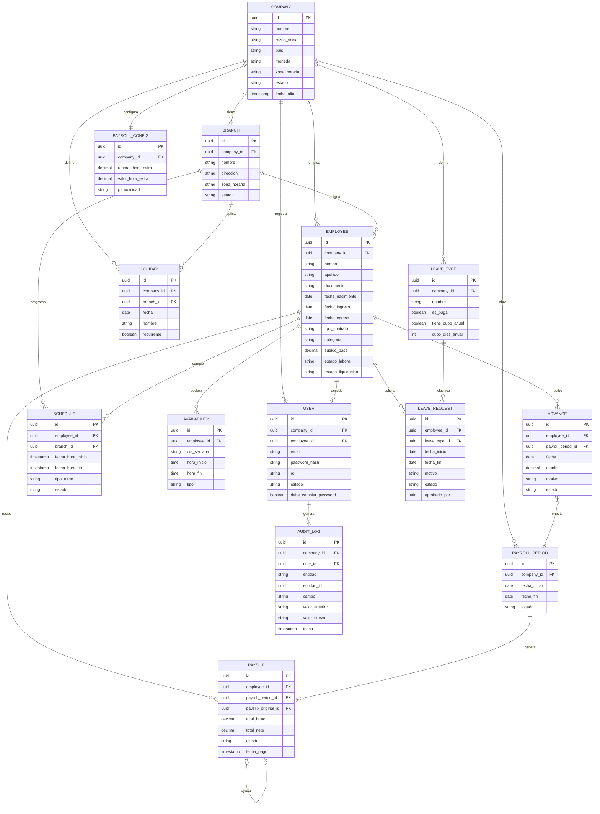

# ERD — Staffly (modelo de datos v1.4)

Diagrama entidad-relación correspondiente a la versión 1.4 del documento de requerimientos. Ver `requerimientos-sistema-gestion-personal.md` para el detalle de cada entidad.

