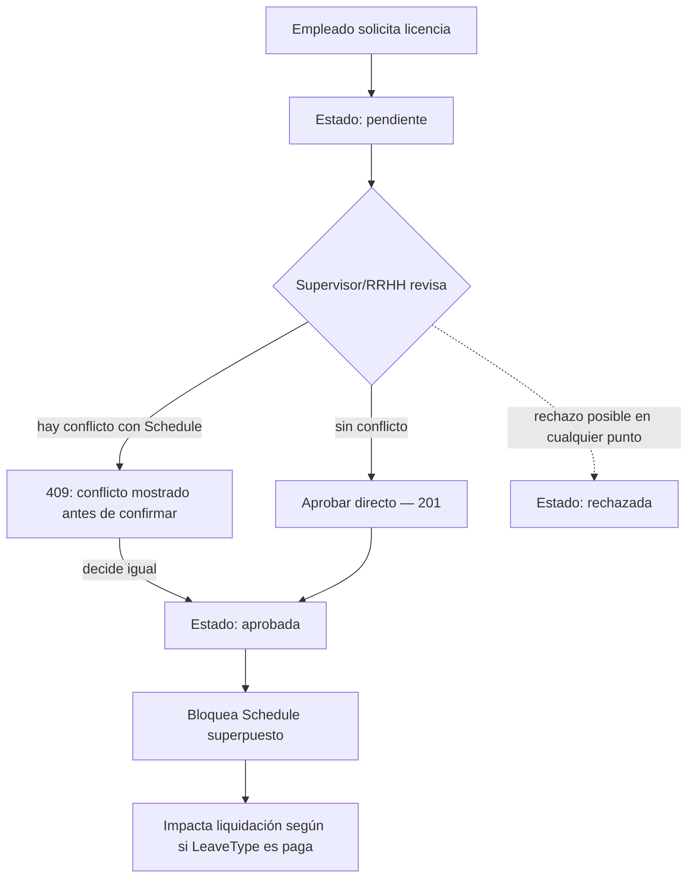
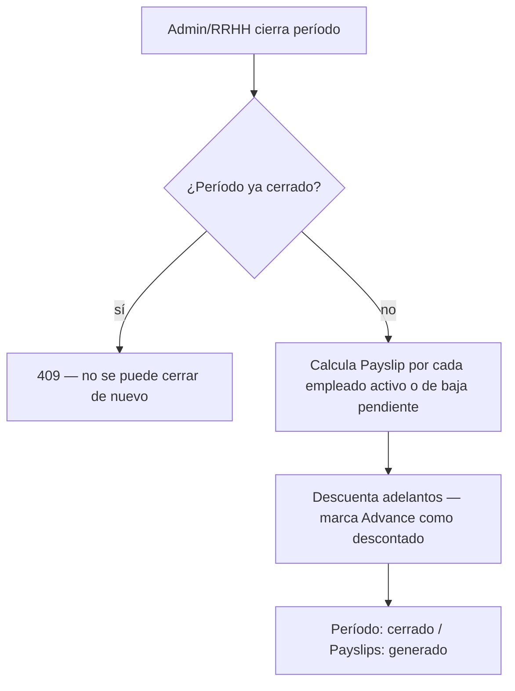
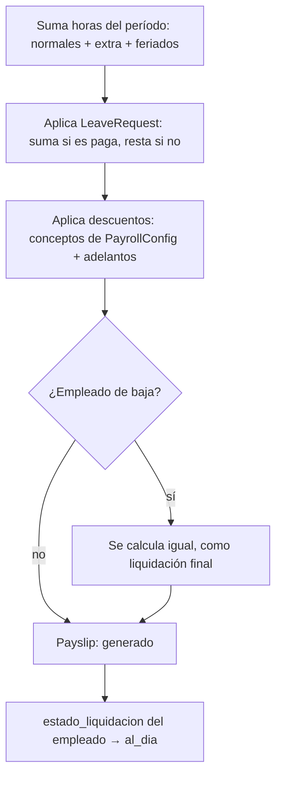

# Staffly — Flujos de proceso (v1)

Complementa `requerimientos-sistema-gestion-personal.md`, `api-design.md` y `ux-decisions.md`. Mapea el orden exacto de pasos de los dos procesos más complejos del sistema, para que la implementación no tenga que inferir el orden de operaciones ni el manejo de casos límite.

---

## 1. Aprobación de solicitud de licencia

**Puntos clave**:
- El chequeo de conflicto contra `Schedule` ocurre **antes** de confirmar la aprobación, no después — el endpoint `POST /leave-requests/{id}/approve` responde 409 con el detalle del conflicto (ver `api-design.md`, sección 9), permitiendo a quien aprueba decidir con la información completa.
- Una vez aprobada, la licencia bloquea la asignación de nuevos turnos superpuestos (RF-15e) — es un bloqueo duro, a diferencia de la advertencia (no bloqueo) que aplica para disponibilidad declarada.
- El impacto en la liquidación (paga/no paga) se resuelve en el momento del **cierre de período**, no en el momento de la aprobación — ver flujo 2.

---

## 2. Cierre de período de nómina

### 2.1 Vista general

### 2.2 Detalle del cálculo individual de cada Payslip (paso C)

**Puntos clave**:
- El cierre es **idempotente respecto al estado**: un período ya cerrado no puede volver a cerrarse (409), evitando duplicar `Payslip`.
- El cálculo de cada `Payslip` incluye a empleados con `estado_laboral = baja` que todavía tengan `estado_liquidacion = pendiente` (RF-07b) — no se los excluye del cierre solo porque ya no estén activos.
- El orden importa: primero se calculan las horas (incluyendo el impacto de licencias), y **recién después** se aplican los descuentos (incluyendo adelantos) — invertir este orden generaría montos incorrectos si algún concepto de descuento es un porcentaje sobre el bruto.
- Al cerrar, el `estado_liquidacion` del empleado pasa a `al_dia` (si no tiene otros saldos pendientes de períodos anteriores — esa validación cruzada queda para diseño técnico detallado, no está resuelta en este diagrama).

### Fuera de este flujo (proceso separado)

La corrección de un `Payslip` ya pagado (anulación + generación de ajuste, RF-20b) **no** forma parte del cierre de período — es un proceso posterior, disparado manualmente por un Admin vía `POST /payslips/{id}/void`. Se documenta como un flujo propio si se necesita mapear en detalle más adelante.
